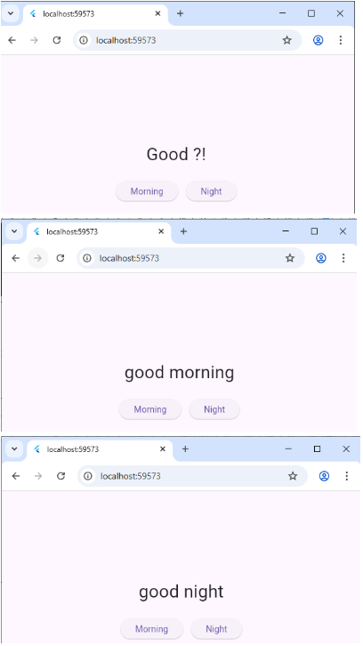
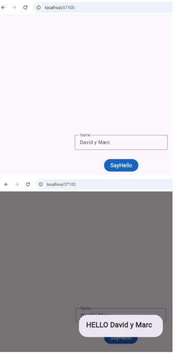
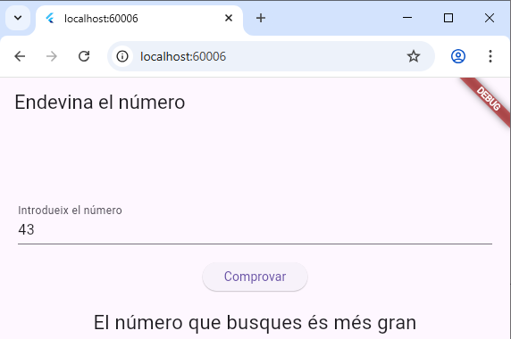
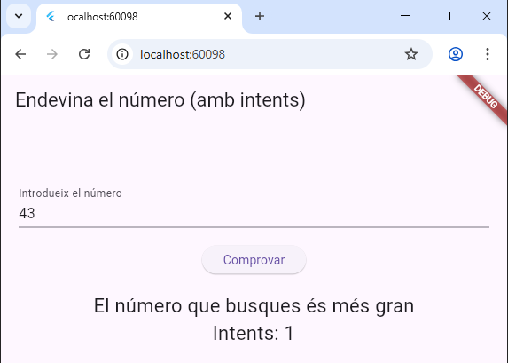
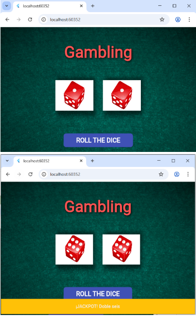
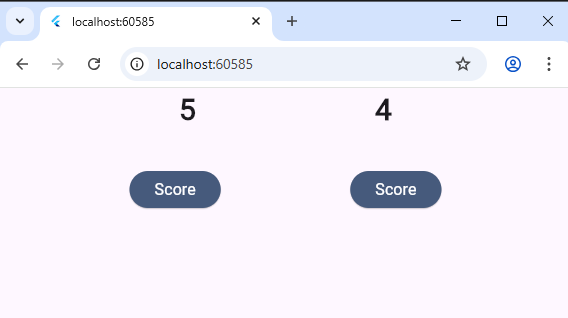
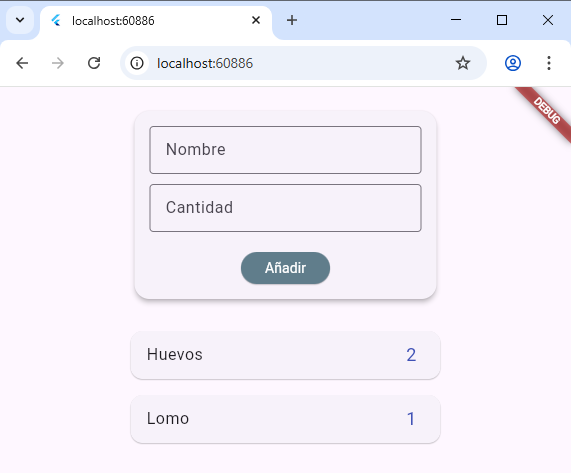

# empty

Resultados ejercicio 2.1: Pantalla StatefulWidget con un saludo inicial “Good ?!” y dos botones; cada botón llama a setState para cambiar el texto a “good morning” o “good night”, lo que produce los resultados mostrados en la captura.

Resultados ejercicio 2.2: Formulario con un TextField controlado por TextEditingController; al pulsar “SayHello”, _showDialog muestra un AlertDialog con “HELLO” + nombre si se escribió algo, logrando la UI del screenshot.

Resultados ejercicio 2.3 sin intentos: (primera versión): Juego de adivinar números. Genera un entero aleatorio entre 0 y 100; el usuario escribe un número y recibe pistas (“más grande/más pequeño”) o “Has encertat!”. El layout centra un TextField, botón y etiqueta para los mensajes.

Resultados ejercicio 2.3 con intentos: (segunda versión): Igual que la anterior, pero guarda un contador de intentos (attempts) y muestra en cada mensaje cuántos intentos van, o el total si se acierta.

Resultados ejercicio 2.4:  Simulador de dados. Dos valores enteros (1..6) determinan qué imagen PNG se muestra para cada dado; al pulsar “ROLL THE DICE” se generan nuevos números con Random. Si ambos son 6, se lanza un SnackBar de “JACKPOT”. El fondo usa una imagen tipo tapete y las sombras resaltan los dados.

Resultados ejercicio 2.5: Marcador simple con dos contadores (scoreLeft, scoreRight). Cada botón incrementa su marcador correspondiente dentro de setState, mostrando los valores en grande en la parte superior, tal como en tu captura.

Resultados ejercicio 2.6: Lista de la compra con controladores para “Nombre” y “Cantidad”. _agregarArticulo valida y añade instancias de ArticuloCompra a una lista ListView.builder, mostrando cada artículo en una tarjeta. Esto produce la vista de formulario + lista observada.

